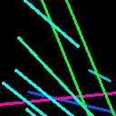
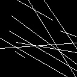
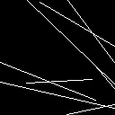

**Advancing Spatial-Temporal Rock Fracture Prediction with Virtual Camera-Based Data Augmentation**

---

## Diagram

<image src="./images/diagram.png">

*Diagram predicting rock fractures in unexcavated areas based on VCT and actual rock face data*

<image src="./images/camera-capture.png">

*Capture or Slice Rock Fractures*

---
## Usage for PredRNN-like Models

If you are using a sequence forecasting model such as PredRNN for rock fracture mapping prediction, you may require a substantial amount of data. Here, we provide a tool to synthesize all the data you need!

1. **Set Fracture Set and Virtual Camera Parameters**:  
   - Configure the fracture set and virtual camera parameters in **[SRM_linedata_no_image.py](./SRM_linedata_no_image.py)**. Please read the functions' input parameters carefully!  
   - Fractures in SRM sliced by a moving target plane and captured by a virtual camera will be saved in the Fracture directory as `.txt` files. These files will then be converted to `.npy` files for model training and testing. The DataFactory is used for data loading. Refer to other scripts for more details.

2. **Data Factory**:  
   - A custom DataLoader for sequence prediction, see **[DataFactory](./DataFactory.py)**.

---

## Data Description

The data includes the following attributes: fracture surface ID, center point coordinates, normal vector, radius, image fracture line center point coordinates, fracture line direction vector, fracture line length, observation distance, target plane position, distance between the target plane and the previous plane, image fracture line segment start point, image fracture line segment end point, actual fracture start point, and actual fracture end point.

| 0 | 1,2,3 | 4,5,6 | 7 | 8,9 | 10,11 | 12 | 13 | 14 | 15 | 16,17 | 18,19 | 20,21 | 22,23 |

- **fracId**: 0  
- **fracCenter(3)**: 1, 2, 3  
- **fracNormal(3)**: 4, 5, 6  
- **fracRadius**: 7  
- **segCenter(2)**: 8, 9  
- **segDirection(2)**: 10, 11  
- **segLength**: 12  
- **ObserveDist**: 13  
- **targetZ**: 14  
- **StepSize**: 15  
- **segStartX**: 16  
- **segStartY**: 17  
- **segEndX**: 18  
- **segEndY**: 19  
- **fracStartX**: 20  
- **fracStartY**: 21  
- **fracEndX**: 22  
- **fracEndY**: 23  

To eliminate the influence of image size, the coordinates are normalized. For details, see [SRM_linedata_no_image.py](./SRM_linedata_no_image.py):

$$
u = \left[ \frac{u_{1x}}{ResX}, \frac{u_{1y}}{ResY} \right]
$$

$$
segCenter = \left[ \frac{u_{1x} + u_{2x}}{2}, \frac{u_{1y} + u_{2y}}{2} \right]
$$

$$
segDirection = normalize \left( \left[ u_{2x} - u_{1x}, u_{2y} - u_{1y} \right] \right)
$$

$$
segLength = \sqrt{(u_{1x} - u_{2x})^2 + (u_{1y} - u_{2y})^2}
$$

Where **ResX** and **ResY** are the image resolutions.

To convert back to image coordinates:

$$
u_x = s_x \times ResX
$$

$$
u_y = s_y \times ResY
$$

---

## Demo Dataset Parameters

| DataSet       | Type    | DipDirection | DipAngle | Fisher Constant | Size      | P30   | Num |
| ------------- | ------- | ------------ | -------- | --------------- | --------- | ----- | ---- |
| Set 1         | Single  | 60           | 40       | 25              | Exp 10 2  | 0.01  | 16   |
| Set 2         | Single  | 210          | 70       | 20              | Exp 10 2  | 0.01  | 16   |
| Set 3         | Single  | 300          | 60       | 15              | Exp 10 2  | 0.01  | 16   |
| Set 4         | Fusion  | All above    | All above | All above      | Exp 10 2  | 0.01  | 16   |
| SetUnion123   | Union123| -            | -        | -               | -         | -     | -    |
| Set All       | Union1234| -           | -        | -               | -         | -     | -    |

---
you can download it from [Baidu,code:zyzs](https://pan.baidu.com/s/1truE9Zr6gsHzGHLH6VlXbw?pwd=zyzs).
## Sequences GIF

| Figure | Description | Animation |
|--------|-------------|-----------|
| **Figure 1** | FixStep Mapping with color-image |  |
| **Figure 2** | FixStep Mapping with binary-image |  |
| **Figure 3** | NRandStep Mapping with color-image |  |
| **Figure 4** | NRandStep Mapping with binary-image |  |

---
---

## Usage

UBG for DFN Model Generation is compiled under Windows with Python 3.10. Python 3.10 is required if you want to generate custom data.

1. **Set Fracture Set and Virtual Camera Parameters**:  
   - Configure the fracture set and virtual camera parameters in **[SRM_linedata_no_image.py](./SRM_linedata_no_image.py)**. Please read the functions' input parameters carefully!  
   - Fractures in SRM sliced by a moving target plane and captured by a virtual camera will be saved in the Fracture directory as `.txt` files. These files will then be converted to `.npy` files for model training and testing. The DataFactory is used for data loading. Refer to other scripts for more details.

2. **For Training PredRNN-like Models**:  
   - See [repository](https://github.com/sungatetop/sequence-forecasting-learning.git) or [subdiroctory](./FracturePrediction/)
---

## Data Factory

A custom DataLoader for sequence prediction, see **[DataFactory](./DataFactory.py)**.

---

## Acknowledgements

- [UnBlocks-gen](https://github.com/ElsevierSoftwareX/SOFTX_2020_237.git)  
- [PredRNN](https://github.com/thuml/predrnn-pytorch.git)

---

## Citation

If you use this tool for your research, we would appreciate it if you cite it as follows:

```
@Misc{Baolin Chen and Jiawei Xie,
  title ={Rock-Camera},
  author={Baolin Chen and Jiawei Xie},
  howpublished ={\url{https://github.com/GEO-ATLAS/Rock-Camera.git}},
  year={2023}
}
```

```
@article{ASTRFPwithVC,
    title={Advancing Spatial-Temporal Rock Fracture Prediction with Virtual Camera-Based Data Augmentation},
    author={Xie, Jiawei and Chen, Baolin and Huang, Jinsong and Zhang, Yuting and Zeng, Cheng},
    journal={Tunnelling and Underground Space Technology},
    volume={158},
    pages={106400},
    year={2025},
    month={4},
    doi={10.1016/j.tust.2025.106400},
    publisher={Elsevier}
}
```
